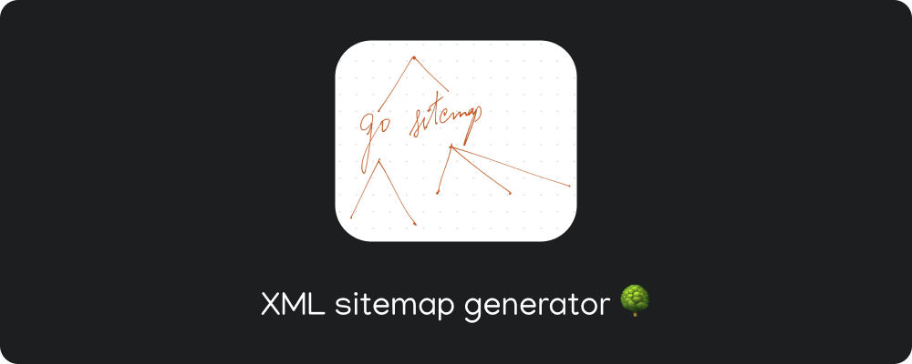

[](https://github.com/r-ush/go-sitemap/blob/master/LICENSE)

# go sitemap!

> go-sitemap is a small cli to build XML sitemap for any website

## sitemap [🖇️](https://developers.google.com/search/docs/advanced/sitemaps/overview)

A sitemap is a file where you provide information about the pages, videos, and other files on your site, and the relationships between them. Search engines like Google read this file to crawl your site more efficiently. A sitemap tells Google which pages and files you think are important in your site, and also provides valuable information about these files. For example, when the page was last updated and any alternate language versions of the page.

## How to build your sitemap [🖇️](https://developers.google.com/search/docs/advanced/sitemaps/build-sitemap)

```sh
go run main.go > sitemap.xml
```

# 🤝 Contributions

- Feel Free to Open a PR/Issue for any feature or bug(s).

## ⚖ License

Copyright 2021 Aarush Bhat

Licensed under MIT License : https://opensource.org/licenses/MIT
